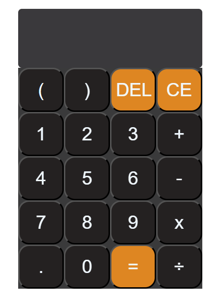

# Calculator ReactJS

This is a simple arithmetic calculator built with REACT.JS library. 

To run it on your local machine clone into the repo, then type: 

    npm install && npm start
 
 Use the live calculator at 
 
    
A sneak peek: 

